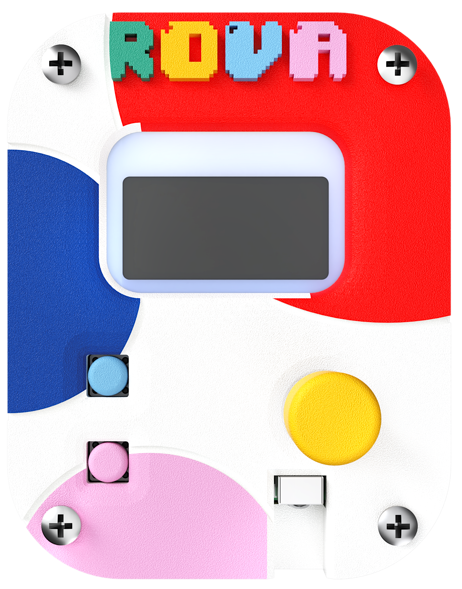
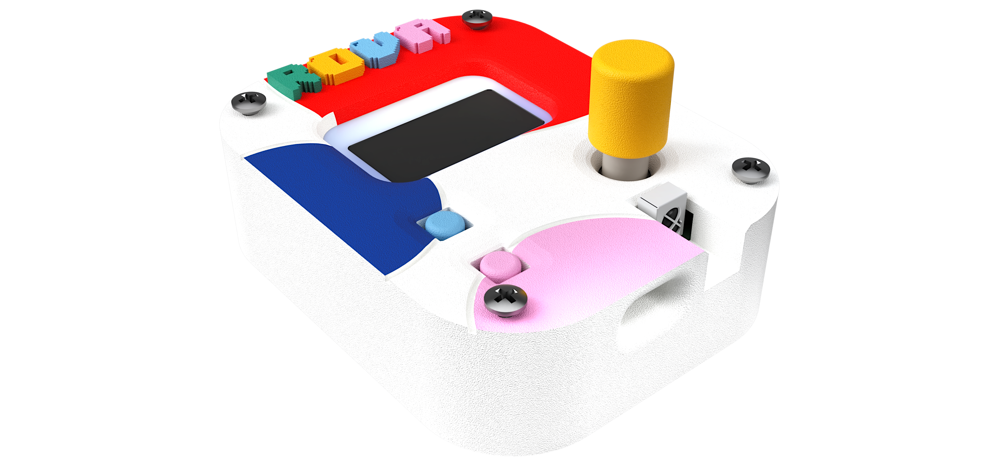
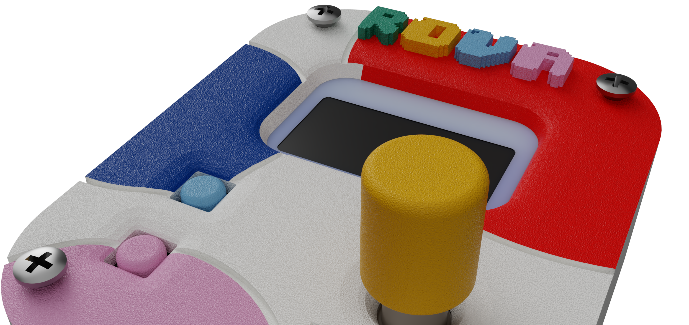
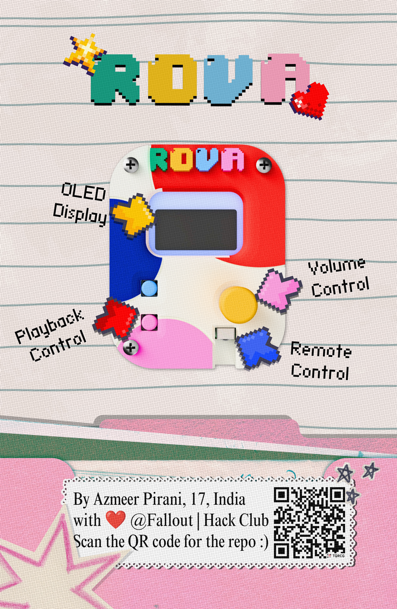
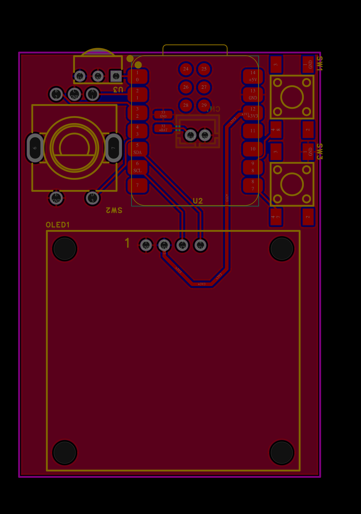
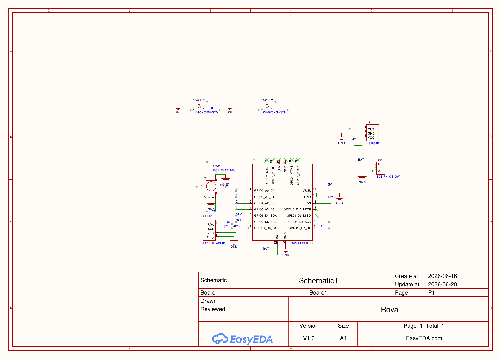

<div align="center">

# 

### A Tiny Device to Control Media

<p>


</p>

### _No More Getting Up to Control Your Music._





</div>

---

# Overview

**Rova** is a compact wireless media controller built around the **Seeed Studio XIAO ESP32-C3**. With a rotary encoder, OLED display, programmable buttons, and IR receiver, it provides an intuitive way to control music and media without reaching for your keyboard.

Designed to be simple, portable, and open source, Rova is easy to build, customize, and use every day.

---

# Gallery

<div align="center">



   

</div>

---

# Zine

<div align="center">



</div>

---

# Motivation

Changing songs, adjusting volume, or pausing music shouldn't interrupt your workflow.

Rova was built as a dedicated desktop controller that keeps your most-used media controls within reach while remaining compact, affordable, and completely open source.

---

# Features

- Wireless media control
- 1.3" OLED display
- Rotary encoder navigation
- Two programmable buttons
- IR remote support
- USB Type-C powered
- Wi-Fi & Bluetooth LE

---

# Hardware

| Component | Details |
|-----------|---------|
| MCU | Seeed Studio XIAO ESP32-C3 |
| Display | 1.3" OLED (128×64) |
| Controls | Rotary Encoder + 2 Push Buttons |
| IR Receiver | VS1838B |
| Connectivity | USB Type-C, Wi-Fi, Bluetooth LE |
| Power | USB Powered |

---

# Bill of Materials (BOM)

| No. | Quantity | Comment | Designator | Footprint | Value | Manufacturer Part | Manufacturer | Supplier Part | Supplier | Link | Price |
|-----|----------|----------|------------|-----------|-------|-------------------|--------------|---------------|----------|------|-------|
|1|1|B2B-PH-K-S-GW|CN1|CONN-TH_B2B-PH-K-S||B2B-PH-K-S-GW|JST|C5251182|LCSC|https://www.lcsc.com/product-detail/C5251182.html|$1.82|
|2|1|HS13L03W2C01|OLED1|OLED-TH_L35.4-W33.5_HS13L03W2C01||HS13L03W2C01|HS|C7465997|LCSC|https://www.lcsc.com/product-detail/C7465997.html|$4.98|
|3|2|KH-6X6X5H-STM|SW1,SW3|SW-SMD_4P-L6.0-W6.0-P4.50-LS9.0_H5.0||KH-6X6X5H-STM|Kinghelm|C2837531|LCSC|https://www.lcsc.com/product-detail/C2837531.html|$0.94|
|4|1|EC11E18244AU|SW2|SW-TH_EC11XXXXXXXX||EC11E18244AU|ALPS Alpine||LCSC|https://www.lcsc.com/product-detail/C202365.html|$2.23|
|5|1|XIAO-ESP32-C3|U2|Seeed XIAO ESP32-C3|ESP32-C3|Seeed Studio|||Robu|https://robu.in/product/seeed-studio-xiao-esp32c3-tiny-mcu-board-with-wi-fi-and-ble-battery-charge-supported-power-efficiency-and-rich-interface/|$6.86|
|6|1|VS1838B|U3|OPTO-TH_VS1838B||VS1838B|||Robu|https://robu.in/product/ir-receiving-head-vs1838b-remote-control-receiver/|$0.48|

---

# PCB Design

The PCB was designed to fit every essential component into the smallest practical footprint while remaining easy to assemble.

It integrates the ESP32-C3, OLD display, rotary encoder, push buttons, IR receiver, and battery connector into a compact handheld layout.

## PCB



## Schematic



---

# Assembly Guide

## 1. Order the PCB

Upload the files located in:

```text
PCB/Gerber.zip
```

to your prefered PCB manufacturer.

---

## 2. Order Components

Use the included BOM:

```text
PCB/BOM.csv
```

---

## 3. Assemble the Board

Recommended tools:

- Fine-tip soldering iron
- Flux
- Tweezers

Assembly order:

1. Push buttons
2. IR receiver
3. Battery conector
4. XIAO ESP32-C3
5. OLED display
6. Rotary encoder

---

## 4. Flash the Firmware

Connect the XIAO ESP32-C3 through USB-C and upload the firmware using:

- Arduino IDE
- PlatformIO

---

# Applications

Rova is perfect for:

- Spotify
- YouTube
- VLC Meia Player
- Presentations
- Video Editing
- Streaming
- Evryday Desktop Use

---

# Repository Structure

```text
Rova/
├── Firmware/
├── PCB/
├── Gallery/
├── LICENSE
└── README.md
```
---

# Current Status

- [X] PCB Completed
- [X] Hardware Designed
- [X] Firmware Developed
- [ ] Final Assembly
---

# Contributing

Contributions, suggestions, and improvments are always welcome.

```bash
git clone https://github.com/<your-username>/Rova.git
cd Rova
```

---

1. Crate a new branch
2. Make your changes
3. Commit yur work
4. Open a Pull Request

---

# Creator

### Azmeer Pirani

Built with ❤️ for makers, students, and anyone who loves tiny hardware.

---

# License

This project is licensed under the MIT License.

---

<div align="center">

# ROVA

### _No More Getting Up to Control Your Music._

</div>
